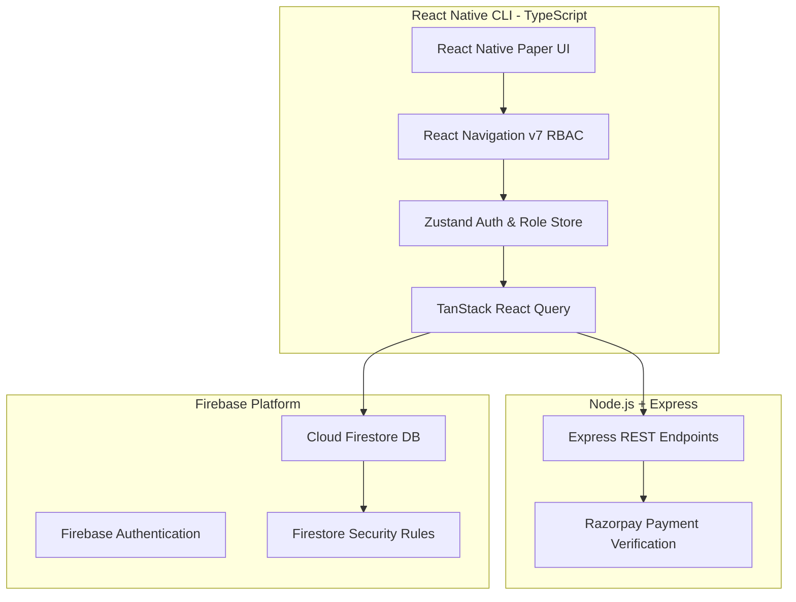

# 🏢 Society ERP — Housing Society & Gated Community Management System

A production-ready, full-stack **Housing Society & Gated Community ERP System** built using **React Native CLI (TypeScript)**, **Node.js Express API**, **Firebase Firestore**, and **Razorpay Payment Gateway**.

---

## 📐 System Architecture



---

## 👥 Core Role-Based Access Control (RBAC) Matrix

The system provides 4 distinct persona interfaces with tailored navigation, dashboards, and security permissions:

| Persona Role | Key Capabilities & Features |
| :--- | :--- |
| 👑 **Super Admin** | Platform-level management, creating new societies, assigning society admins, system audit logs. |
| 👔 **Society Admin** | Financial dashboard, issue maintenance bills, track collections, assign complaints, publish notice board. |
| 🏡 **Resident** | View & pay society maintenance bills (Razorpay), pre-approve visitors (Passcode/QR), raise maintenance tickets. |
| 🛡️ **Security Guard** | Gate check-in/out console, 6-digit passcode & QR verification, walk-in visitor entry logging. |

---

## 📂 Project Structure

```
Society/
├── 📱 mobile/                    # React Native CLI Mobile Application
│   ├── src/
│   │   ├── components/        # Reusable UI components & Glassmorphism cards
│   │   ├── config/            # App theme, Indigo palette (#4F46E5), mock data
│   │   ├── features/          # Modular feature domains:
│   │   │   ├── amenities/     # Facility & amenity booking
│   │   │   ├── auth/          # Login, Register, Role Selector
│   │   │   ├── billing/       # Issue bills, payment list, receipt preview
│   │   │   ├── complaints/    # Raise & track maintenance tickets
│   │   │   ├── dashboard/     # Role-specific analytics dashboards
│   │   │   ├── notices/       # Society announcements & notice board
│   │   │   ├── profile/       # User details & Live Role Persona Switcher
│   │   │   └── visitors/      # Pre-approvals & Gatekeeper check-in console
│   │   ├── navigation/        # React Navigation v7 with dynamic RBAC Tabs
│   │   ├── store/             # Zustand state management
│   │   └── types/             # Domain TypeScript interfaces & models
│   ├── android/               # Android native project files
│   ├── ios/                   # iOS native project files
│   └── package.json
│
├── ⚙️ backend/                   # Node.js + Express API Server
│   ├── src/
│   │   └── app.ts             # Express server setup & payment endpoints
│   ├── package.json
│   └── tsconfig.json
│
├── 🔒 firestore.rules            # Granular Firestore Security Rules for RBAC
└── 📑 scripts/
    └── seed.ts                # TypeScript script to populate Firestore mock data
```

---

## 🛠️ Technology Stack

- **Mobile Frontend**: React Native CLI (`0.86`), TypeScript (`^5.8`), React Native Paper (`^5.15`), React Navigation (`v7`), `react-native-safe-area-context`, `react-native-vector-icons`.
- **State Management & Data Fetching**: Zustand (`^5.0`), TanStack React Query (`^5.101`).
- **Backend API**: Node.js, Express (`^4.19`), TypeScript, Razorpay Node SDK.
- **Database & Security**: Cloud Firestore, Firebase Admin SDK, Firebase Security Rules (`firestore.rules`).
- **Utilities**: `date-fns`, `zod`, `react-hook-form`.

---

## 🚀 Step-by-Step Setup & Execution

### 1. Prerequisites
Ensure you have the following installed on your machine:
- **Node.js** `>= 22.11.0`
- **npm** or **yarn**
- **Android Studio** (with Android SDK & Emulator configured) or **Xcode** (for Mac users targeting iOS).

---

### 2. Mobile App Setup (React Native CLI)

```bash
# Navigate to mobile app directory
cd mobile

# Install dependencies
npm install

# Option A: Start Metro Bundler
npm start

# Option B: Run on Android Emulator (in a separate terminal)
npm run android

# Option C: Run on iOS Simulator (macOS only)
npm run ios
```

---

### 3. Backend Setup

```bash
# Navigate to backend directory
cd backend

# Install backend dependencies
npm install

# Start Express server in development mode (Runs on http://localhost:5000)
npm run dev
```

---

### 4. Database Seeding (Firestore)

To populate sample societies, units, users, bills, and visitor pre-approvals:

```bash
# Run database seed script from root
npx ts-node scripts/seed.ts
```

---

## 🔑 Live Persona Switcher (Testing Mode)

For development and demo testing, the mobile app includes an instant **Core Role Persona Switcher** inside the **Profile Screen**:
- Toggle seamlessly between **Super Admin**, **Society Admin**, **Resident**, and **Security Guard**.
- Navigation tabs and permissions update dynamically without logging out.

---

## ❓ Common Troubleshooting & FAQ

#### Q1: `sh: react-native: command not found` or `EJSONPARSE`
**Fix**: Ensure `mobile/package.json` is clean valid JSON, then run `npm install` inside the `mobile/` directory to link `.bin` executables properly.

#### Q2: Metro bundler module resolution issue
**Fix**: Reset Metro cache by starting Metro with the clear cache flag:
```bash
npx react-native start --reset-cache
```

#### Q3: Android build failures (`./gradlew app:installDebug`)
**Fix**:
1. Ensure your Android Emulator is booted (`adb devices`).
2. Clean gradle cache:
```bash
cd mobile/android
./gradlew clean
cd ..
npx @react-native-community/cli run-android
```
